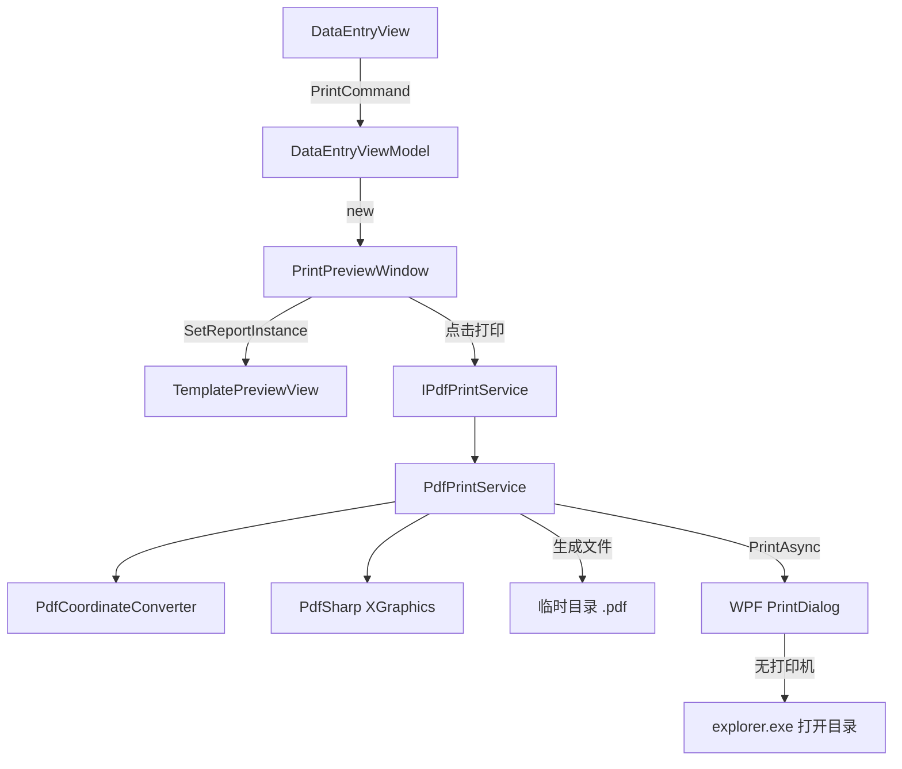

# 设计文档：PDF 打印引擎（pdf-print-engine）

## 概述

本功能为 xinglin WPF 病理检验报告系统新增 PDF 生成与打印能力。核心流程为：

1. 用户在数据录入界面（`DataEntryView`）点击"打印"按钮
2. 系统打开 `PrintPreviewWindow`，复用现有 `TemplatePreviewView` 展示报告预览
3. 用户确认后，`PdfPrintService` 将 `ReportInstance` + `TemplateData` 渲染为 PDF 文件
4. 系统调用 WPF `PrintDialog` 发送至打印机；若无打印机则打开 PDF 所在目录

设计目标：最小化新增代码量，最大化复用现有渲染逻辑，保持与 `TemplatePreviewView` 的视觉一致性。

---

## 架构



### 新增文件清单

| 文件路径 | 说明 |
|---|---|
| `xinglin/Services/Pdf/IPdfPrintService.cs` | 打印服务接口 |
| `xinglin/Services/Pdf/PdfPrintService.cs` | 打印服务实现 |
| `xinglin/Services/Pdf/PdfCoordinateConverter.cs` | 坐标/单位转换工具类 |
| `xinglin/Views/PrintPreviewWindow.xaml` | 打印预览窗口 XAML |
| `xinglin/Views/PrintPreviewWindow.xaml.cs` | 打印预览窗口 Code-behind |

修改文件：

| 文件路径 | 修改内容 |
|---|---|
| `xinglin/ViewModels/DataEntryViewModel.cs` | 新增 `PrintCommand` |
| `xinglin/App.xaml.cs` | 注册 `IPdfPrintService` |
| `xinglin/xinglin.csproj` | 添加 PdfSharp、System.Drawing.Common、FsCheck NuGet 引用 |

---

## 组件与接口

### IPdfPrintService

```csharp
namespace xinglin.Services.Pdf
{
    public interface IPdfPrintService
    {
        /// <summary>生成 PDF，返回文件完整路径</summary>
        Task<string> GeneratePdfAsync(ReportInstance report, TemplateData template);

        /// <summary>将指定 PDF 文件发送至打印机；无打印机时打开所在目录</summary>
        Task PrintAsync(string pdfFilePath);
    }
}
```

### PdfCoordinateConverter

纯静态工具类，封装所有单位转换逻辑，与 PdfSharp 无直接依赖，便于独立测试。

```csharp
public static class PdfCoordinateConverter
{
    // 像素（96 dpi）→ PDF 点（72 dpi）
    public static double PixelsToPoints(double pixels) => pixels * 72.0 / 96.0;

    // 毫米 → PDF 点
    public static double MmToPoints(double mm) => mm * 72.0 / 25.4;

    // 根据 IsLandscape 返回 (pageWidth, pageHeight)（单位：点）
    public static (double width, double height) GetPageSize(LayoutMetadata layout)
    {
        double w = MmToPoints(layout.PaperWidth);
        double h = MmToPoints(layout.PaperHeight);
        return layout.IsLandscape ? (h, w) : (w, h);
    }

    // 返回内容区起始点（页边距偏移），单位：点
    public static (double originX, double originY) GetContentOrigin(LayoutMetadata layout)
        => (MmToPoints(layout.MarginLeft), MmToPoints(layout.MarginTop));
}
```

### PdfPrintService

实现 `IPdfPrintService`，依赖 `PdfCoordinateConverter` 进行坐标转换，使用 PdfSharp `XGraphics` 绘制各控件类型。

构造函数注入 `ILoggerService`（已有接口）用于错误日志。

渲染分发方法签名：

```csharp
private void RenderElement(XGraphics gfx, ControlElement el, ReportData data, double originX, double originY)
```

所有控件的绘制坐标均加上 `originX`/`originY` 页边距偏移：

```csharp
double x = PdfCoordinateConverter.PixelsToPoints(el.X) + originX;
double y = PdfCoordinateConverter.PixelsToPoints(el.Y) + originY;
```

### PrintPreviewWindow

独立 `Window`，不继承任何 ViewModel，通过构造函数接收 `ReportInstance`、`TemplateData`、`IPdfPrintService`。

---

## 数据模型

本功能不新增数据模型，直接使用现有模型：

- `ReportInstance`：包含 `ReportData`（`Fields` 字典 + `Tables` 字典）及 `ReportId`
- `TemplateData`：包含 `LayoutMetadata`（纸张规格、边距、`FixedElements`、`EditableElements`）
- `ControlElement`：`X/Y` 为像素（96 dpi），`Width/Height` 为毫米
- `TableElement`：继承 `ControlElement`，含 `Columns`（`TableColumn` 列表）和 `Rows`（`TableRow` 列表）

### 坐标转换说明

| 属性 | 原始单位 | 转换方式 |
|---|---|---|
| `ControlElement.X` / `Y` | 像素（96 dpi） | `PixelsToPoints(x) + originX` |
| `ControlElement.Width` / `Height` | 毫米 | `mm × 72 / 25.4` |
| `LayoutMetadata.PaperWidth` / `PaperHeight` | 毫米 | `mm × 72 / 25.4` |
| `LayoutMetadata.MarginLeft` / `MarginTop` | 毫米 | `GetContentOrigin` 返回 `(originX, originY)` |

---

## 各控件类型渲染方案

### Label / TextBox

使用 `XGraphics.DrawString`，字体通过 `new XFont(element.FontFamily, element.FontSize, style)` 构建。`style` 由 `IsBold`/`IsItalic` 组合为 `XFontStyleEx`。若字体不存在，PdfSharp 会抛出异常，在 `PdfPrintService` 中 catch 后回退到 `Microsoft YaHei`。

- Label：绘制 `element.Text`
- TextBox：绘制 `reportData.Fields[element.BindingPath]`（键不存在时绘制空字符串）

### CheckBox

在元素坐标处绘制固定大小（8pt × 8pt）的矩形边框，若字段值为 `"true"`（忽略大小写），则在矩形内绘制 `×` 符号（`XGraphics.DrawString("×", ...)`）。

### Table（TableElement）

1. 绘制表头行：遍历 `Columns`，按 `TableColumn.Width`（毫米转点）分配列宽，绘制列名文本和单元格边框
2. 绘制数据行：遍历 `ReportData.Tables[BindingPath]`，每行按列顺序绘制单元格值和边框
3. 若行数据超出元素高度，截断不再绘制（不换页，单页设计）

### Line

使用 `XGraphics.DrawLine`，从 `(X, Y)` 到 `(X + Width_in_points, Y)`（水平线）或 `(X, Y + Height_in_points)`（垂直线）。判断依据：`Width > Height` 则为水平线。

### Rectangle

使用 `XGraphics.DrawRectangle`，绘制边框矩形（不填充）。

---

## PrintPreviewWindow XAML 结构

```xml
<Window x:Class="xinglin.Views.PrintPreviewWindow"
        Title="打印预览" Width="900" Height="700"
        WindowStartupLocation="CenterOwner">
    <Grid>
        <Grid.RowDefinitions>
            <RowDefinition Height="*"/>
            <RowDefinition Height="Auto"/>
        </Grid.RowDefinitions>

        <!-- 预览区域：ScrollViewer 内嵌 TemplatePreviewView，自适应缩放 -->
        <ScrollViewer Grid.Row="0" HorizontalScrollBarVisibility="Auto"
                      VerticalScrollBarVisibility="Auto">
            <Viewbox Stretch="Uniform" Margin="16">
                <views:TemplatePreviewView x:Name="PreviewView"/>
            </Viewbox>
        </ScrollViewer>

        <!-- 底部按钮栏 -->
        <StackPanel Grid.Row="1" Orientation="Horizontal"
                    HorizontalAlignment="Right" Margin="16,8">
            <Button x:Name="PrintButton" Content="打印" Width="80"
                    Click="PrintButton_Click" Margin="0,0,8,0"/>
            <Button x:Name="CancelButton" Content="取消" Width="80"
                    Click="CancelButton_Click"/>
        </StackPanel>
    </Grid>
</Window>
```

Code-behind 关键逻辑：

```csharp
public partial class PrintPreviewWindow : Window
{
    private readonly ReportInstance _report;
    private readonly TemplateData _template;
    private readonly IPdfPrintService _printService;

    public PrintPreviewWindow(ReportInstance report, TemplateData template,
                              IPdfPrintService printService)
    {
        InitializeComponent();
        _report = report; _template = template; _printService = printService;
        PreviewView.SetReportInstance(report, template);
    }

    private async void PrintButton_Click(object sender, RoutedEventArgs e)
    {
        PrintButton.IsEnabled = false;
        try
        {
            var path = await _printService.GeneratePdfAsync(_report, _template);
            await _printService.PrintAsync(path);
            Close();
        }
        catch (Exception ex)
        {
            MessageBox.Show($"打印失败：{ex.Message}", "错误",
                            MessageBoxButton.OK, MessageBoxImage.Error);
        }
        finally { PrintButton.IsEnabled = true; }
    }

    private void CancelButton_Click(object sender, RoutedEventArgs e) => Close();
}
```

---

## DataEntryViewModel 集成

在 `DataEntryViewModel` 中新增：

```csharp
[ObservableProperty]
private bool _isPrintPreviewOpen;

[RelayCommand(CanExecute = nameof(CanPrint))]
public async Task PrintAsync()
{
    if (CurrentTemplate == null || GeneratedReport == null)
    {
        ErrorMessage = "请先生成报告后再打印！";
        return;
    }

    IsPrintPreviewOpen = true;
    PrintCommand.NotifyCanExecuteChanged();
    try
    {
        var printService = App.ServiceProvider.GetRequiredService<IPdfPrintService>();
        var window = new PrintPreviewWindow(GeneratedReport, CurrentTemplate, printService);
        window.Owner = Application.Current.MainWindow;
        window.ShowDialog();
    }
    finally
    {
        IsPrintPreviewOpen = false;
        PrintCommand.NotifyCanExecuteChanged();
    }
}

private bool CanPrint() => !IsPrintPreviewOpen && GeneratedReport != null;
```

`DataEntryView.xaml` 中绑定打印按钮：

```xml
<Button Content="打印" Command="{Binding PrintCommand}"/>
```

---

## 依赖注入注册

在 `App.xaml.cs` 的 `ConfigureServices` 中添加：

```csharp
services.AddSingleton<IPdfPrintService, PdfPrintService>();
```

`PdfPrintService` 构造函数签名：

```csharp
public PdfPrintService(ILoggerService logger)
```

---

## 正确性属性

*属性（Property）是在系统所有合法执行路径上都应成立的特征或行为——本质上是对系统应做什么的形式化陈述。属性是人类可读规范与机器可验证正确性保证之间的桥梁。*

### 属性 1：像素到点的单位转换

*对任意* 非负像素值，`PdfCoordinateConverter.PixelsToPoints(pixels)` 的返回值应等于 `pixels × 72.0 / 96.0`，误差不超过 1e-9。

**验证：需求 2.1**

---

### 属性 2：毫米到点的单位转换

*对任意* 非负毫米值，`PdfCoordinateConverter.MmToPoints(mm)` 的返回值应等于 `mm × 72.0 / 25.4`，误差不超过 1e-9。

**验证：需求 2.2、2.3**

---

### 属性 3：横向纸张宽高互换

*对任意* `LayoutMetadata`（`PaperWidth = w`，`PaperHeight = h`，`IsLandscape = true`），`GetPageSize` 返回的宽度应等于 `MmToPoints(h)`，高度应等于 `MmToPoints(w)`；竖向时宽度等于 `MmToPoints(w)`，高度等于 `MmToPoints(h)`。

**验证：需求 2.4**

---

### 属性 4：文本内容渲染到 PDF

*对任意* 包含 `Label` 或 `TextBox` 控件的 `ReportInstance` + `TemplateData`，调用 `GeneratePdfAsync` 生成的 PDF 文件中，应能从 PDF 内容流中找到对应的文本字符串（通过 PdfSharp 读取 PDF 内容验证）。

**验证：需求 3.1、3.2**

---

### 属性 5：表格行数据渲染到 PDF

*对任意* 包含 `Table` 控件且 `ReportData.Tables` 有对应数据的报告，生成的 PDF 中应包含所有列名文本和所有行的单元格文本。

**验证：需求 3.4**

---

### 属性 6：PDF 文件生成路径格式

*对任意* 合法的 `ReportInstance` + `TemplateData`，`GeneratePdfAsync` 返回的路径应满足：文件存在于 `Path.GetTempPath()` 目录下，文件名匹配正则 `^Report_[^_]+_\d{14}\.pdf$`，且文件实际存在于磁盘。

**验证：需求 5.1、5.4**

---

### 属性 7：PDF 页面尺寸与模板一致

*对任意* `LayoutMetadata`（A4 或 A5，横向或竖向），生成的 PDF 页面尺寸（点）应与 `PdfCoordinateConverter.GetPageSize(layout)` 的返回值一致，误差不超过 0.5pt。

**验证：需求 5.2**

---

### 属性 8：null 参数抛出 ArgumentNullException

*对任意* `GeneratePdfAsync(null, template)` 或 `GeneratePdfAsync(report, null)` 的调用，系统应抛出 `ArgumentNullException`，且不生成任何文件。

**验证：需求 7.4**

---

## 错误处理

| 场景 | 处理方式 |
|---|---|
| `report` 或 `template` 为 null | `GeneratePdfAsync` 抛出 `ArgumentNullException` |
| 指定字体不存在 | catch 后回退到 `Microsoft YaHei`，继续渲染 |
| PDF 文件写入失败（磁盘满等） | 抛出原始异常，`PrintPreviewWindow` 显示 `MessageBox` |
| 打印过程出错 | `ILoggerService` 记录日志，`PrintPreviewWindow` 显示错误，已生成 PDF 不删除 |
| 无可用打印机 | 跳过 `PrintDialog`，调用 `Process.Start("explorer.exe", folderPath)` |
| `TemplateData` 无法加载 | `DataEntryViewModel.PrintAsync` 设置 `ErrorMessage`，不打开预览窗口 |

---

## 测试策略

### 双轨测试方法

单元测试和属性测试互补，共同保证覆盖率：

- **单元测试**：验证具体示例、边界条件、错误路径
- **属性测试**：验证对所有合法输入都成立的普遍规律

### 属性测试配置

使用 **FsCheck**（.NET 属性测试库，NuGet: `FsCheck` + `FsCheck.MsTest`）。每个属性测试最少运行 **100 次**迭代。

每个属性测试必须包含注释标记：

```
// Feature: pdf-print-engine, Property {N}: {property_text}
```

#### 属性测试列表

| 属性 | 测试方法 | 生成器 |
|---|---|---|
| 属性 1：像素转点 | 生成随机非负 double，验证公式 | `Arb.Generate<NonNegativeInt>()` |
| 属性 2：毫米转点 | 生成随机非负 double，验证公式 | 同上 |
| 属性 3：横向宽高互换 | 生成随机 PaperWidth/Height + IsLandscape，验证 GetPageSize | 自定义生成器 |
| 属性 4：文本渲染 | 生成随机 Label/TextBox 元素 + 字段值，生成 PDF 后用 PdfSharp 读取验证 | 自定义生成器 |
| 属性 5：表格渲染 | 生成随机列定义 + 行数据，验证 PDF 包含所有文本 | 自定义生成器 |
| 属性 6：文件路径格式 | 生成随机合法报告，验证路径格式和文件存在 | 自定义生成器 |
| 属性 7：页面尺寸 | 生成随机 LayoutMetadata，验证 PDF 页面尺寸 | 自定义生成器 |
| 属性 8：null 参数 | 枚举 null 组合，验证 ArgumentNullException | 固定输入 |

### 单元测试列表

| 测试场景 | 类型 |
|---|---|
| A4 竖向页面尺寸（210mm × 297mm）转换正确 | example |
| A5 横向页面尺寸（210mm × 148mm）转换正确 | example |
| CheckBox 选中状态渲染（"true" → 绘制 ×） | example |
| CheckBox 未选中状态渲染（"false" → 空矩形） | example |
| 字体不存在时回退到 Microsoft YaHei 不抛异常 | edge-case |
| 无打印机时打开目录而非调用 PrintDialog | example |
| 打印失败时 PDF 文件不被删除 | edge-case |
| `IPdfPrintService` 可从 DI 容器解析 | example |
| `DataEntryViewModel.PrintCommand` 存在且类型正确 | example |
| 预览窗口打开时 `PrintCommand.CanExecute` 返回 false | example |
| `TemplateData` 加载失败时 `ErrorMessage` 被设置 | example |
