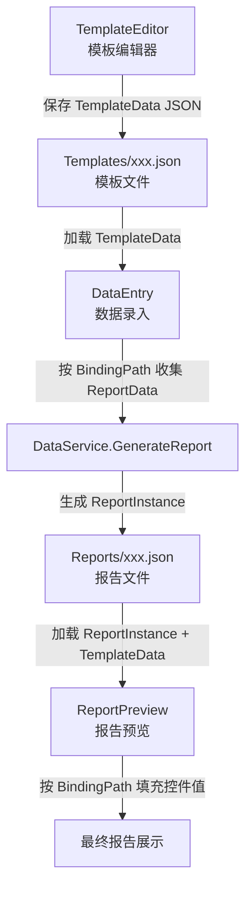
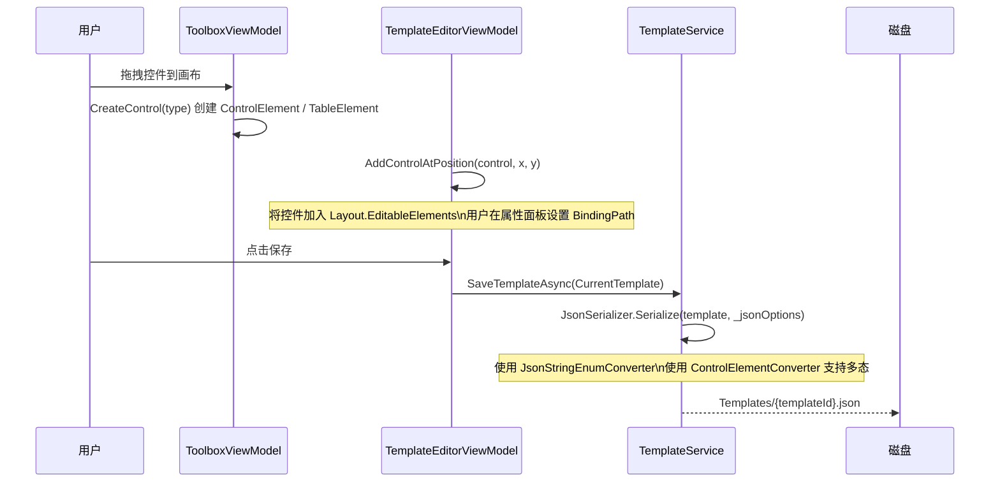
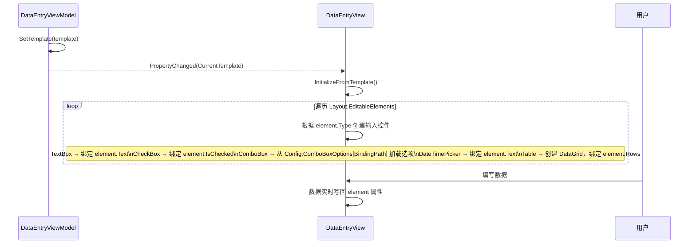
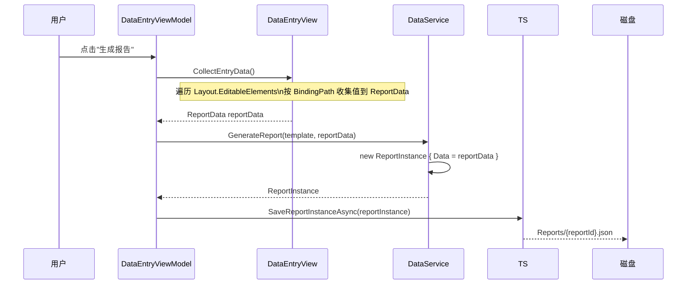
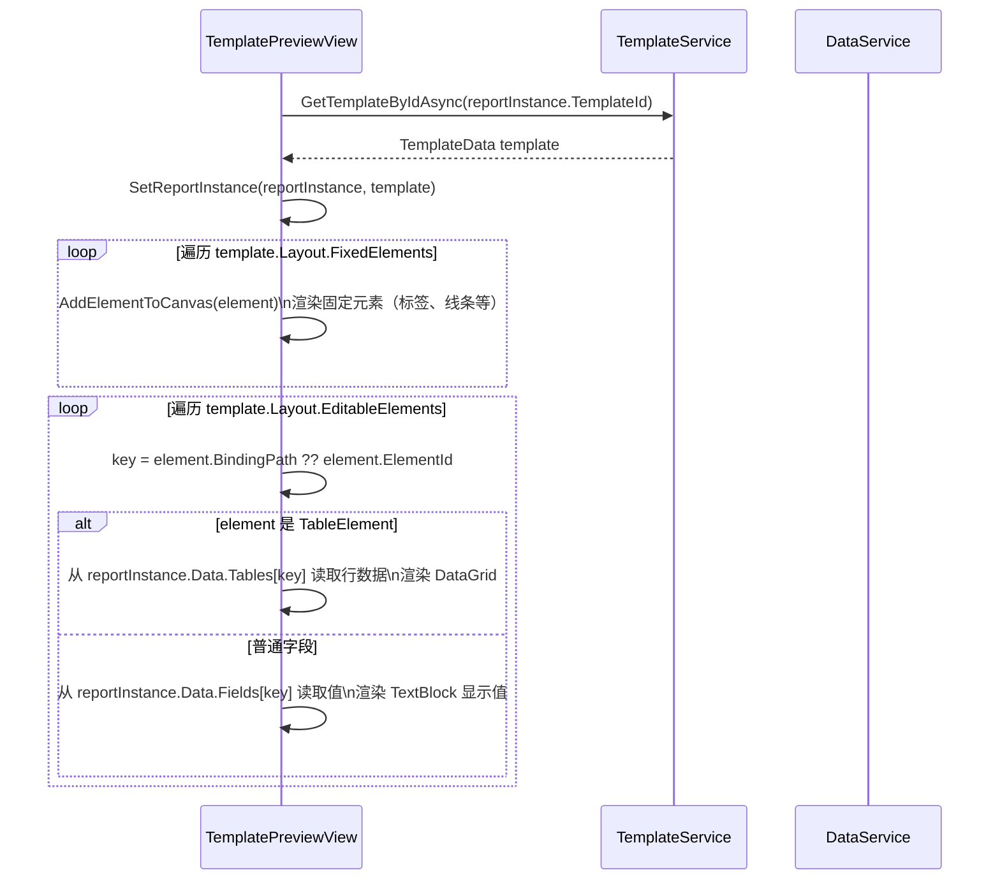
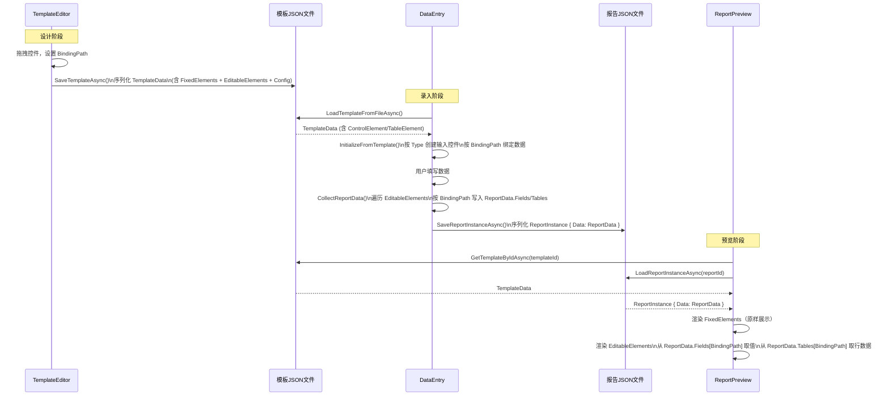

# 设计文档：报告数据流转（report-data-flow）

## 概述

本文档梳理报告录入（DataEntry）和模板编辑（TemplateEditor）两个系统之间的控件元素结构与报告 JSON 的完整流转路径，并明确需要补齐的代码，确保两个系统的数据可以正常流转。

当前系统存在以下核心问题：
1. `ControlType` 枚举值与 JSON 文件中的 `Type` 数值不一致（JSON 中 Line=16，代码中 Line=8）
2. `ReportInstance.Data` 是弱类型 `object`，无法按字段反查录入值
3. `DataEntryView` 中控件绑定到 `element.Text`，但 `GenerateReport` 传入的是空对象 `new {}`，录入值未被收集
4. `BindingPath` 在录入阶段未被用于组织数据字典
5. `TableElement` 的行数据在录入时没有对应的 UI 控件和数据收集逻辑
6. `TemplateData.Config` 是弱类型 `object`，ComboBox 选项无强类型定义

---

## 架构总览



---

## 一、统一控件类型枚举

### 问题

`Report_Template.json` 中 `"Type": 16` 表示 Line，但 `ControlType` 枚举中 `Line = 8`。这是因为 JSON 文件是手写的，与代码枚举不同步。

### 解决方案

**不修改枚举值**，而是修复 JSON 文件中的错误值，并在序列化时使用字符串枚举名称（而非数字），从根本上避免此类不一致。

#### 1.1 枚举定义（保持不变，值已正确）

```csharp
public enum ControlType
{
    Label          = 0,
    TextBox        = 1,
    CheckBox       = 2,
    RadioButton    = 3,
    ComboBox       = 4,
    DateTimePicker = 5,
    Table          = 6,
    Image          = 7,
    Line           = 8,
    Rectangle      = 9
}
```

#### 1.2 JSON 序列化配置（使用字符串枚举）

在 `TemplateService` 和 `DataService` 的所有 `JsonSerializer` 调用中，统一加入 `JsonStringEnumConverter`：

```csharp
private static readonly JsonSerializerOptions _jsonOptions = new JsonSerializerOptions
{
    WriteIndented = true,
    Converters = { new JsonStringEnumConverter() },
    // 支持多态反序列化 ControlElement / TableElement
    PropertyNameCaseInsensitive = true
};
```

#### 1.3 修复现有 JSON 文件

将 `Report_Template.json` 及所有 `baseTemplate/*.json` 中的 `"Type": 16` 改为 `"Type": "Line"`（或 `"Type": 8`），并将所有数字 Type 值改为字符串形式，例如：

```json
{ "Type": "Label" }
{ "Type": "TextBox" }
{ "Type": "Line" }
```

#### 1.4 多态反序列化支持（TableElement）

`LayoutMetadata.EditableElements` 是 `ObservableCollection<ControlElement>`，但 `TableElement` 继承自 `ControlElement`。需要自定义 `JsonConverter` 以支持多态反序列化：

```csharp
public class ControlElementConverter : JsonConverter<ControlElement>
{
    public override ControlElement Read(ref Utf8JsonReader reader, Type typeToConvert, JsonSerializerOptions options)
    {
        // 先读取 Type 字段，若为 Table 则反序列化为 TableElement，否则为 ControlElement
        using var doc = JsonDocument.ParseValue(ref reader);
        var root = doc.RootElement;
        if (root.TryGetProperty("Type", out var typeProp))
        {
            var typeStr = typeProp.GetString();
            if (typeStr == "Table" || typeStr == "6")
                return JsonSerializer.Deserialize<TableElement>(root.GetRawText(), options);
        }
        return JsonSerializer.Deserialize<ControlElement>(root.GetRawText(), options);
    }

    public override void Write(Utf8JsonWriter writer, ControlElement value, JsonSerializerOptions options)
    {
        if (value is TableElement tableElement)
            JsonSerializer.Serialize(writer, tableElement, options);
        else
            JsonSerializer.Serialize(writer, value, options);
    }
}
```

---

## 二、标准化报告数据结构

### 问题

`ReportInstance.Data` 是 `object`，无法按字段反查，也无法在预览时按 `BindingPath` 填充控件值。

### 解决方案

引入强类型 `ReportData`，替代 `object`。

#### 2.1 ReportData 模型

```csharp
// 新增文件：xinglin/Models/CoreEntities/ReportData.cs
public class ReportData
{
    /// <summary>
    /// 普通字段数据：key = BindingPath，value = 用户录入的字符串值
    /// 例如：{ "PatientName": "张三", "PatientAge": "35", "ExamDate": "2026-01-15" }
    /// </summary>
    public Dictionary<string, string> Fields { get; set; } = new();

    /// <summary>
    /// 表格数据：key = TableElement.BindingPath（或 ElementId），value = 行数据列表
    /// 例如：{ "ResultTable": [ { "ItemName": "血糖", "Result": "5.6", "Unit": "mmol/L" } ] }
    /// </summary>
    public Dictionary<string, List<Dictionary<string, string>>> Tables { get; set; } = new();
}
```

#### 2.2 修改 ReportInstance

```csharp
public class ReportInstance
{
    public string ReportId { get; set; } = Guid.NewGuid().ToString();
    public string TemplateId { get; set; }
    public string TemplateVersion { get; set; }
    public ReportData Data { get; set; } = new();   // 从 object 改为 ReportData
    public DateTime CreatedDate { get; set; } = DateTime.Now;
    public DateTime ModifiedDate { get; set; } = DateTime.Now;
}
```

#### 2.3 ReportData JSON 示例

```json
{
  "ReportId": "abc-123",
  "TemplateId": "report-template",
  "TemplateVersion": "1.0",
  "Data": {
    "Fields": {
      "PatientName": "张三",
      "PatientAge": "35",
      "PatientGender": "男",
      "ExamDate": "2026-01-15",
      "DoctorName": "李医生"
    },
    "Tables": {
      "ResultTable": [
        { "ItemName": "血糖", "Result": "5.6", "RefRange": "3.9-6.1", "Unit": "mmol/L" },
        { "ItemName": "血红蛋白", "Result": "130", "RefRange": "120-160", "Unit": "g/L" }
      ]
    }
  }
}
```

---

## 三、Config 字段强类型设计

### 问题

`TemplateData.Config` 是 `object`，ComboBox 选项、验证规则等配置无强类型定义，`DataEntryView` 中需要多层类型转换才能读取。

### 解决方案

#### 3.1 TemplateConfig 模型

```csharp
// 新增文件：xinglin/Models/CoreEntities/TemplateConfig.cs
public class TemplateConfig
{
    /// <summary>
    /// ComboBox 选项配置：key = BindingPath，value = 选项列表
    /// 例如：{ "PatientGender": ["男", "女", "未知"] }
    /// </summary>
    public Dictionary<string, List<string>> ComboBoxOptions { get; set; } = new();

    /// <summary>
    /// 字段验证规则：key = BindingPath，value = 验证规则
    /// </summary>
    public Dictionary<string, FieldValidationRule> ValidationRules { get; set; } = new();
}

public class FieldValidationRule
{
    public bool IsRequired { get; set; } = false;
    public int? MaxLength { get; set; }
    public string? RegexPattern { get; set; }
    public string? ErrorMessage { get; set; }
}
```

#### 3.2 修改 TemplateData

```csharp
// 将 object _config 改为强类型
[ObservableProperty]
private TemplateConfig _config = new TemplateConfig();
```

#### 3.3 Config JSON 示例

```json
"Config": {
  "ComboBoxOptions": {
    "PatientGender": ["男", "女", "未知"],
    "Department": ["内科", "外科", "儿科", "妇科"]
  },
  "ValidationRules": {
    "PatientName": { "IsRequired": true, "MaxLength": 50, "ErrorMessage": "姓名不能为空" },
    "PatientAge":  { "IsRequired": true, "RegexPattern": "^\\d{1,3}$", "ErrorMessage": "年龄必须为数字" }
  }
}
```

---

## 四、完整数据流转设计

### 4.1 模板编辑 → 模板 JSON



**关键约束：**
- 每个 `EditableElement` 必须设置唯一的 `BindingPath`（模板编辑器属性面板应强制要求）
- `TableElement` 的每个 `TableColumn` 也必须设置 `BindingPath`（列名级别的字段映射）
- `FixedElements` 中的控件不参与数据收集，仅用于展示

### 4.2 模板 JSON → 数据录入界面



**DataEntryView.InitializeFromTemplate() 补齐逻辑：**

```csharp
case ControlType.Table:
    var tableElement = element as TableElement;
    if (tableElement != null)
    {
        var dataGrid = new DataGrid
        {
            AutoGenerateColumns = false,
            CanUserAddRows = tableElement.AllowAddRows,
            ItemsSource = tableElement.Rows  // 绑定到 TableElement.Rows
        };
        foreach (var col in tableElement.Columns)
        {
            var column = new DataGridTextColumn
            {
                Header = col.Name,
                Binding = new Binding($"CellValues[{col.Name}]"),
                IsReadOnly = !col.IsEditable
            };
            dataGrid.Columns.Add(column);
        }
        inputControl = dataGrid;
    }
    break;

case ControlType.DateTimePicker:
    var datePicker = new DatePicker();
    // 双向绑定到 element.Text（格式：yyyy-MM-dd）
    datePicker.SetBinding(DatePicker.SelectedDateProperty,
        new Binding("Text") { Source = element, Mode = BindingMode.TwoWay,
            Converter = new StringToDateConverter() });
    inputControl = datePicker;
    break;
```

### 4.3 数据录入 → ReportInstance



**DataEntryViewModel 中数据收集方法（补齐）：**

```csharp
// DataEntryViewModel 中新增
public ReportData CollectReportData()
{
    var reportData = new ReportData();
    if (CurrentTemplate?.Layout == null) return reportData;

    foreach (var element in CurrentTemplate.Layout.EditableElements)
    {
        var key = string.IsNullOrEmpty(element.BindingPath) ? element.ElementId : element.BindingPath;

        if (element is TableElement tableElement)
        {
            // 收集表格行数据
            var rows = tableElement.Rows
                .Select(r => new Dictionary<string, string>(r.CellValues))
                .ToList();
            reportData.Tables[key] = rows;
        }
        else
        {
            // 收集普通字段值
            var value = element.Type switch
            {
                ControlType.CheckBox       => element.IsChecked.ToString(),
                ControlType.ComboBox       => element.SelectedValue ?? string.Empty,
                ControlType.DateTimePicker => element.Text ?? string.Empty,
                _                          => element.Text ?? string.Empty
            };
            reportData.Fields[key] = value;
        }
    }
    return reportData;
}
```

**修改 GenerateReportAsync：**

```csharp
[RelayCommand]
public async Task GenerateReportAsync()
{
    if (CurrentTemplate == null) return;

    var reportData = CollectReportData();   // 替换原来的 EntryData = new {}
    EntryData = reportData;
    ValidateData();

    if (!IsValid) { ErrorMessage = "数据验证失败，请检查输入！"; return; }

    IsLoading = true;
    try
    {
        GeneratedReport = _dataService.GenerateReport(CurrentTemplate, reportData);
        await _templateService.SaveReportInstanceAsync(GeneratedReport);
        SuccessMessage = "报告生成成功！";
    }
    finally { IsLoading = false; }
}
```

### 4.4 ReportInstance → 报告预览



**TemplatePreviewView.SetReportInstance() 补齐逻辑：**

```csharp
public void SetReportInstance(ReportInstance reportInstance, TemplateData template)
{
    PreviewCanvas.Children.Clear();
    PreviewCanvas.Width = template.Layout.PaperWidth;
    PreviewCanvas.Height = template.Layout.PaperHeight;

    // 渲染固定元素
    foreach (var element in template.Layout.FixedElements)
        AddElementToCanvas(element, null);

    // 渲染可编辑元素（填入录入值）
    foreach (var element in template.Layout.EditableElements)
    {
        var key = string.IsNullOrEmpty(element.BindingPath) ? element.ElementId : element.BindingPath;
        if (element is TableElement tableElement)
        {
            var rows = reportInstance.Data.Tables.TryGetValue(key, out var r) ? r : new();
            AddTableToCanvas(tableElement, rows);
        }
        else
        {
            var value = reportInstance.Data.Fields.TryGetValue(key, out var v) ? v : string.Empty;
            AddFieldToCanvas(element, value);
        }
    }
}
```

---

## 五、TableElement 录入数据结构

### 5.1 模板中的 TableElement 定义

```json
{
  "ElementId": "table-results",
  "Type": "Table",
  "DisplayName": "检验结果表",
  "BindingPath": "ResultTable",
  "X": 20, "Y": 160, "Width": 170, "Height": 80,
  "Columns": [
    { "Name": "项目名称", "BindingPath": "ItemName", "Width": 60, "ControlType": "TextBox", "IsEditable": false, "Index": 0 },
    { "Name": "结果",     "BindingPath": "Result",   "Width": 40, "ControlType": "TextBox", "IsEditable": true,  "Index": 1 },
    { "Name": "参考范围", "BindingPath": "RefRange",  "Width": 40, "ControlType": "Label",   "IsEditable": false, "Index": 2 },
    { "Name": "单位",     "BindingPath": "Unit",      "Width": 30, "ControlType": "Label",   "IsEditable": false, "Index": 3 }
  ],
  "RowCount": 3,
  "AllowAddRows": true
}
```

### 5.2 录入时的行数据结构

`TableElement.Rows` 是 `ObservableCollection<TableRow>`，每行的 `CellValues` 以列名（`TableColumn.Name`）为 key：

```csharp
// TableRow.CellValues 示例
{
    "项目名称": "血糖",
    "结果": "5.6",
    "参考范围": "3.9-6.1",
    "单位": "mmol/L"
}
```

### 5.3 收集到 ReportData 时的结构

收集时以 `TableColumn.BindingPath` 为 key（而非列名），便于跨语言/跨模板版本的数据一致性：

```csharp
// ReportData.Tables["ResultTable"] 示例
[
    { "ItemName": "血糖",   "Result": "5.6",  "RefRange": "3.9-6.1", "Unit": "mmol/L" },
    { "ItemName": "血红蛋白", "Result": "130", "RefRange": "120-160", "Unit": "g/L" }
]
```

### 5.4 DataEntryView 中 Table 控件的初始化

```csharp
// 初始化时，若 TableElement.Rows 为空，按 RowCount 预填空行
if (tableElement.Rows.Count == 0)
{
    for (int i = 0; i < tableElement.RowCount; i++)
    {
        var row = new TableRow { RowIndex = i };
        foreach (var col in tableElement.Columns)
            row.CellValues[col.Name] = col.DefaultValue ?? string.Empty;
        tableElement.Rows.Add(row);
    }
}
```

---

## 六、数据验证流转

### 6.1 验证时机

| 时机 | 触发方 | 验证内容 |
|------|--------|----------|
| 字段值变更时 | DataEntryView（实时） | 单字段格式验证（正则、长度） |
| 点击"生成报告"前 | DataEntryViewModel | 全量验证（必填、格式、业务规则） |
| 加载报告实例时 | DataEntryViewModel | 数据完整性校验 |

### 6.2 修改 ValidateDataWithTemplate

```csharp
public ValidationResult ValidateDataWithTemplate(ReportData data, TemplateData template)
{
    var result = new ValidationResult();
    if (template?.Layout == null) return result;

    foreach (var element in template.Layout.EditableElements)
    {
        var key = string.IsNullOrEmpty(element.BindingPath) ? element.ElementId : element.BindingPath;
        var rule = template.Config?.ValidationRules?.GetValueOrDefault(key);
        if (rule == null) continue;

        if (rule.IsRequired)
        {
            var hasValue = element is TableElement
                ? data.Tables.ContainsKey(key) && data.Tables[key].Count > 0
                : data.Fields.TryGetValue(key, out var v) && !string.IsNullOrWhiteSpace(v);

            if (!hasValue)
                result.AddError(key, rule.ErrorMessage ?? $"{element.DisplayName} 不能为空");
        }
        // 正则验证...
    }
    return result;
}
```

---

## 七、正确性属性

*属性是在系统所有有效执行中都应成立的特征或行为，是人类可读规范与机器可验证正确性保证之间的桥梁。*

### 属性 1：ControlType 枚举序列化 round-trip

*对任意* ControlElement 对象，将其序列化为 JSON 后再反序列化，得到的 ControlElement 的 Type 字段应与原始值相等，且序列化后的 JSON 中 Type 字段应为字符串形式（如 `"Label"`）而非数字。

**验证：需求 1.2、1.3**

### 属性 2：TableElement 多态反序列化正确性

*对任意* 包含 `"Type": "Table"` 的 JSON 片段，反序列化后得到的对象应为 TableElement 实例，且其 Columns 和 Rows 字段应被正确还原。

**验证：需求 2.1、2.2、2.4**

### 属性 3：ReportData 序列化 round-trip

*对任意* ReportData 对象（包含任意 Fields 和 Tables 内容），序列化为 JSON 后再反序列化，应得到与原始对象等价的 ReportData（Fields 和 Tables 的所有键值对均相同）。

**验证：需求 3.4**

### 属性 4：CollectReportData 覆盖所有 EditableElements

*对任意* 包含 n 个 EditableElements 的 TemplateData，调用 CollectReportData() 后，ReportData.Fields 中的 key 集合与 ReportData.Tables 中的 key 集合的并集，应等于所有 EditableElements 的 BindingPath（或 ElementId）集合，无遗漏。

**验证：需求 6.1、6.2、6.3**

### 属性 5：TableElement 行数据以列 BindingPath 为 key 收集

*对任意* TableElement，其 Rows 中每行的 CellValues 以列名为 key；CollectReportData() 收集后，ReportData.Tables 中对应条目的每行字典应以列的 BindingPath 为 key，而非列名。

**验证：需求 6.4**

### 属性 6：Table 控件空行预填数量等于 RowCount

*对任意* Rows 为空的 TableElement，DataEntryView 初始化后，TableElement.Rows.Count 应等于 TableElement.RowCount。

**验证：需求 5.7**

### 属性 7：必填字段为空时验证失败

*对任意* 标记了 IsRequired=true 的字段，若 ReportData.Fields 中对应值为空字符串或纯空白字符串，ValidateDataWithTemplate 返回的 ValidationResult 应包含该字段的错误条目。

**验证：需求 9.2**

### 属性 8：必填表格为空时验证失败

*对任意* 标记了 IsRequired=true 的 TableElement，若 ReportData.Tables 中对应 key 不存在或行数为 0，ValidateDataWithTemplate 返回的 ValidationResult 应包含该字段的错误条目。

**验证：需求 9.3**

### 属性 9：预览渲染值与 ReportData 一致

*对任意* ReportInstance 和对应的 TemplateData，TemplatePreviewView 渲染后，每个 EditableElement 对应位置显示的值应等于 ReportData.Fields[element.BindingPath] 或 ReportData.Tables[element.BindingPath] 中存储的值。

**验证：需求 8.3、8.4**

---

## 八、需要补齐的代码清单

### 8.1 新增文件

| 文件路径 | 说明 |
|----------|------|
| `xinglin/Models/CoreEntities/ReportData.cs` | 强类型报告数据模型（Fields + Tables） |
| `xinglin/Models/CoreEntities/TemplateConfig.cs` | 强类型模板配置（ComboBoxOptions + ValidationRules） |
| `xinglin/Services/Data/ControlElementConverter.cs` | 支持 TableElement 多态反序列化的 JsonConverter |
| `xinglin/Views/StringToDateConverter.cs` | DatePicker 双向绑定用的字符串↔日期转换器 |

### 8.2 修改现有文件

| 文件路径 | 修改内容 |
|----------|----------|
| `xinglin/Models/CoreEntities/ReportInstance.cs` | `Data` 字段类型从 `object` 改为 `ReportData` |
| `xinglin/Models/CoreEntities/TemplateData.cs` | `Config` 字段类型从 `object` 改为 `TemplateConfig` |
| `xinglin/Services/Data/TemplateService.cs` | 所有 `JsonSerializer` 调用统一使用含 `JsonStringEnumConverter` 和 `ControlElementConverter` 的 `_jsonOptions` |
| `xinglin/Services/Data/DataService.cs` | `GenerateReport` 参数改为 `ReportData`；`ValidateDataWithTemplate` 参数改为 `ReportData` |
| `xinglin/Services/Data/IDataService.cs` | 接口签名同步更新 |
| `xinglin/ViewModels/DataEntryViewModel.cs` | 新增 `CollectReportData()` 方法；`GenerateReportAsync` 调用 `CollectReportData()` 替代 `new {}` |
| `xinglin/Views/DataEntryView.xaml.cs` | `InitializeFromTemplate()` 补齐 Table 类型的 DataGrid 创建逻辑；DateTimePicker 绑定补齐 |
| `xinglin/Views/TemplatePreviewView.xaml.cs` | `SetReportInstance()` 接受 `(ReportInstance, TemplateData)` 参数，按 BindingPath 填充值 |
| `xinglin/Assets/baseTemplate/*.json` | 修复 `"Type": 16` → `"Type": "Line"`；所有 Type 值改为字符串形式 |

### 8.3 修改优先级

```
P0（阻塞数据流转）：
  - ReportInstance.Data 改为 ReportData
  - DataEntryViewModel.CollectReportData() 实现
  - GenerateReportAsync 调用 CollectReportData()

P1（保证数据正确性）：
  - ControlElementConverter 实现（支持 TableElement 反序列化）
  - JsonSerializer 统一配置（修复枚举值不一致）
  - JSON 文件修复（Type=16 → Type="Line"）

P2（完善功能）：
  - TemplateConfig 强类型（替代 object Config）
  - DataEntryView Table 控件补齐
  - TemplatePreviewView 按 BindingPath 填充值
  - 验证逻辑使用 ReportData 强类型
```

---

## 九、数据流转完整示意


